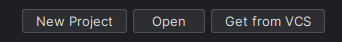
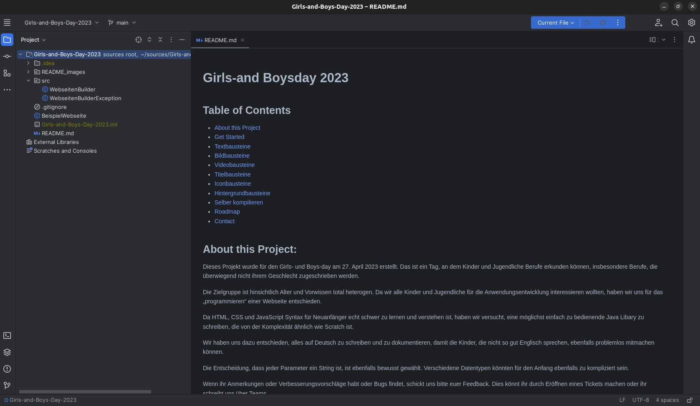

# WebseitenParser Python

Willkommen bei deinem eigenen Webseiten-Parser! Mit diesem Parser kannst du ganz einfach Elemente wie Texte, Bilder und Videos auf deiner eigenen Webseite platzieren. Hier erfährst du, wie jede Funktion verwendet wird, und bekommst Beispiele, die dir helfen, diese selbst auszuprobieren.

## Zu Hause weiterarbeiten:

Wenn du zu Hause weiter an deiner Webseite arbeiten willst, kannst du diese folgendermaßen machen:

1. Hol dir ein Programm, mit dem du deine Webseite machen kannst. Ein gutes Programm ist PyCharm. Du kannst es hier
   kostenlos herunterladen: [PyCharm-Community Edition](https://www.jetbrains.com/pycharm/download/?section=windows).
   Suche nach der kostenlosen Community Edition und lade sie herunter.

2. Kopiere unser Projekt. Dafür klickst du auf den Knopf "Get from VCS".
   

3. Füge diesen Link in das Feld "URL:" ein: `https://github.com/fweigel-dev/Girls-and-Boys-Day-2024.git` und klicke
   auf "Clone".

4. Dein Bildschirm sollte jetzt so aussehen:



5. Lade deinen eigenen Code aus der E-Mail herunter.

6. Öffne die Dateien index.html und MeineWebseite.py aus der E-Mail und kopiere den Inhalt in PyCharm.

7. Klicke auf das Symbol von deinem bevorzugten Browser in der index.html.

8. Wenn du Änderungen gemacht hast, klicke auf den grünen Dreieck/Play-Knopf oben rechts, um deinen Code zu starten.

## Grundlegende Funktionen

### Texte

#### `text(text: str)`

Fügt Text auf deiner Webseite hinzu.

- **Beispiel:**
  - Um "Hallo Welt!" auf deine Seite zu setzen, schreibst du:
    ```python
    text("Hallo Welt!")
    ```

### Bilder

#### `image(url: str)`
Fügt ein Bild auf deiner Webseite hinzu.

- **Beispiel:**
  - Um ein Bild von "https://example.com/image.jpg" auf deine Seite zu setzen, schreibst du:
    ```python
    image("https://example.com/image.jpg")
    ```

### Videos

#### `video(url: str)`
Fügt ein Video auf deiner Webseite hinzu.

- **Beispiel:**
  - Um ein Video von "https://example.com/video.mp4" auf deine Seite zu setzen, schreibst du:
    ```python
    video("https://example.com/video.mp4")
    ```

## Fortgeschrittene Funktionen

### Hintergrund

#### `titel(text: str)`
Ändert den Titel deiner Webseite.

- **Beispiel:**
  - Um den Titel deiner Webseite in "Meine Webseite" zu ändern, schreibst du:
    ```python
    titel("Meine Webseite")
    ```

#### `icon(url: str)`
Ändert das Icon deiner Webseite.

- **Beispiel:**
  - Um das Icon deiner Webseite in "https://example.com/icon.png" zu ändern, schreibst du:
    ```python
    icon("https://example.com/icon.png")
    ```

### Layout

#### `hintergrundbild(url: str)`
Ändert das Hintergrundbild deiner Webseite.

- **Beispiel:**
  - Um das Hintergrundbild deiner Webseite in "https://example.com/background.jpg" zu ändern, schreibst du:
    ```python
    hintergrundbild("https://example.com/background.jpg")
    ```

#### `hintergrundfarbe(farbe: str)`
Ändert die Hintergrundfarbe deiner Webseite.

- **Beispiel:**
  - Um die Hintergrundfarbe deiner Webseite in "blau" zu ändern, schreibst du:
    ```python
    hintergrundfarbe("blue")
    ```
### Bearbeitung von Elementen

### Beispiel mit Bild

```python
image("https://example.com/image.jpg")
```

#### `breiter()`
Macht das zuletzt erstellte Element breiter.

- **Beispiel:**
  - Um das zuletzt erstellte Bild breiter zu machen, schreibst du:
    ```python
    breiter()
    ```

#### `schmaler()`
Macht das zuletzt erstellte Element schmaler.

- **Beispiel:**
  - Um das zuletzt erstellte Bild schmaler zu machen, schreibst du:
    ```python
    schmaler()
    ```

#### `links()` und `rechts()`
Platziert das zuletzt erstellte Element links oder rechts.

- **Beispiel:**
    - Um das zuletzt erstellte Bild links zu platzieren, schreibst du:
        ```python
        links()
        ```
    - Um das zuletzt erstellte Bild rechts zu platzieren, schreibst du:
        ```python
        rechts()
        ```

#### `hoeher()` und `tiefer()`
Platziert das zuletzt erstellte Element auf der Y-Achse höher oder tiefer.

- **Beispiel:**
    - Um das zuletzt erstellte Bild höher zu platzieren, schreibst du:
        ```python
        hoeher()
        ```
    - Um das zuletzt erstellte Bild tiefer zu platzieren, schreibst du:
        ```python
        tiefer()
        ```
#### `oben()` und `unten()`
Platziert das zuletzt erstellte Element auf der X-Achse oben oder unten.

- **Beispiel:**
    - Um das zuletzt erstellte Bild oben zu platzieren, schreibst du:
        ```python
        oben()
        ```
    - Um das zuletzt erstellte Bild unten zu platzieren, schreibst du:
        ```python
        unten()
        ```

#### `verschieben_nach_rechts(pixel: int)` und `verschieben_nach_links(pixel: int)`
Verschiebt das zuletzt erstellte Element nach rechts oder links.

- **Beispiel:**
    - Um das zuletzt erstellte Bild um 50 Pixel nach rechts zu verschieben, schreibst du:
        ```python
        verschieben_nach_rechts(50)
        ```
    - Um das zuletzt erstellte Bild um 50 Pixel nach links zu verschieben, schreibst du:
        ```python
        verschieben_nach_links(50)
        ```

#### `verschieben_nach_oben(pixel: int)` und `verschieben_nach_unten(pixel: int)`
Verschiebt das zuletzt erstellte Element nach oben oder unten.

- **Beispiel:**
    - Um das zuletzt erstellte Bild um 50 Pixel nach oben zu verschieben, schreibst du:
        ```python
        verschieben_nach_oben(50)
        ```
    - Um das zuletzt erstellte Bild um 50 Pixel nach unten zu verschieben, schreibst du:
        ```python
        verschieben_nach_unten(50)
        ```

### Text bearbeiten

#### `textgroesser()` und `textkleiner()`
Macht den zuletzt erstellten Text größer oder kleiner.

- **Beispiel:**
    - Um den zuletzt erstellten Text größer zu machen, schreibst du:
        ```python
        textgroesser()
        ```
    - Um den zuletzt erstellten Text kleiner zu machen, schreibst du:
        ```python
        textkleiner()
        ```

#### `textdicker()` und `textduenner()`
Macht den zuletzt erstellten Text dicker oder dünner.

- **Beispiel:**
    - Um den zuletzt erstellten Text dicker zu machen, schreibst du:
        ```python
        textdicker()
        ```
    - Um den zuletzt erstellten Text dünner zu machen, schreibst du:
        ```python
        textduenner()
        ```

#### `farbe(farbe: str)`
Ändert die Farbe des zuletzt erstellten Textes.

- **Beispiel:**
    - Um die Farbe des zuletzt erstellten Textes in "rot" zu ändern, schreibst du:
        ```python
        farbe("red")
        ```
### Bilder bearbeiten

#### `bild_breite(pixel: int)` und `bild_hoehe(pixel: int)`
Ändert die Breite oder Höhe des zuletzt erstellten Bildes.

- **Beispiel:**
    - Um die Breite des zuletzt erstellten Bildes auf 200 Pixel zu ändern, schreibst du:
        ```python
        bild_breite(200)
        ```
    - Um die Höhe des zuletzt erstellten Bildes auf 200 Pixel zu ändern, schreibst du:
        ```python
        bild_hoehe(200)
        ```

### Bauen
Nachdem alle Funktionen verwendet wurden, muss die Webseite gebaut werden.

#### `bauen()`
Baut die Webseite.

- **Beispiel:**
    - Um die Webseite zu bauen, schreibst du:
        ```python
        bauen()
        ```
    Diese funktion muss ans Ende des Codes gesetzt werden, damit die Webseite gebaut wird.

Nachdem die Webseite gebaut wurde, liegt nun eine index.html Datei im gleichen Ordner wie das Python-Script. Diese Datei kann nun in einem Browser geöffnet werden, um die Webseite zu betrachten.

