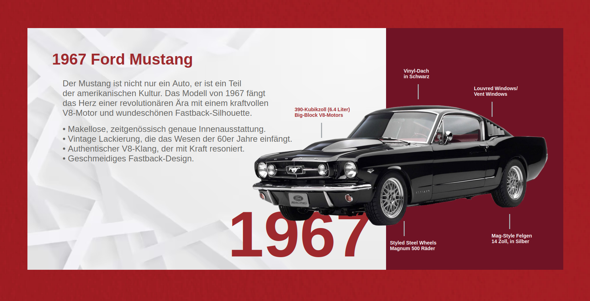

# Beispiel:

Folgende Webseite wurde mit dem WebseitenBuilder erstellt:




Der Code für die Webseite wurde mit dem WebseitenBuilder erstellt, dieser ist sehr vereinfacht und verwendet absichtlich keine Schleifen oder Funktionen, um die Einstiegshürde zu senken.

```python
from WebseitenBuilder import bauen, text, bild, titel, icon, hintergrundbild, \
    verschieben_nach_unten, verschieben_nach_rechts, textgroesser, farbe, textdicker, \
    schmaler, tiefer, textkleiner, bild_breite, bild_hoehe

icon("https://cdn.icon-icons.com/icons2/2402/PNG/512/ford_logo_icon_145825.png")
titel("1967 Ford Mustang")

hintergrundbild(
    "https://www.misspompadour.de/media/d7/97/91/1635548554/misspompadour-rot-mit-kirsche-farbe-wand-ansicht.jpg")

# weißes feld links
bild(
    "https://img.freepik.com/free-vector/white-abstract-wallpaper_23-2148830027.jpg")
schmaler()
schmaler()
schmaler()
tiefer()
tiefer()
verschieben_nach_rechts(80)
verschieben_nach_unten(80)

# rotes feld rechts
bild(
    "https://www.tapetenunduhren.de/pub/media/catalog/product/cache/f240d79e5e2abbc46ca3bddc9368ed2e/f/a/farbe-little-greene-192-theatre-red.jpg")
schmaler()
schmaler()
schmaler()
schmaler()
schmaler()
schmaler()
schmaler()
tiefer()
tiefer()
verschieben_nach_rechts(1100)
verschieben_nach_unten(80)

text("1967")
farbe("#9e292d")
textgroesser()
textgroesser()
textgroesser()
textgroesser()
textgroesser()
textgroesser()
textgroesser()
textgroesser()
textgroesser()
textgroesser()
textgroesser()
textgroesser()
textgroesser()
textgroesser()
textgroesser()
textgroesser()
textdicker()
verschieben_nach_unten(380)
verschieben_nach_rechts(650)

# auto
bild("https://i.pinimg.com/originals/a3/dc/a8/a3dca83531a5c40ff95ba71eff4867f2.png")
schmaler()
schmaler()
schmaler()
schmaler()
schmaler()
tiefer()
tiefer()
tiefer()
tiefer()
tiefer()
tiefer()
verschieben_nach_unten(300)
verschieben_nach_rechts(720)

text("1967 Ford Mustang")
textgroesser()
textgroesser()
textdicker()
farbe("#9e292d")
verschieben_nach_unten(100)
verschieben_nach_rechts(150)

text(
    "Der Mustang ist nicht nur ein Auto, er ist ein Teil<br>"
    "der amerikanischen Kultur. Das Modell von 1967 fängt<br>"
    "das Herz einer revolutionären Ära mit einem kraftvollen<br>"
    "V8-Motor und wundeschönen Fastback-Silhouette.")
verschieben_nach_unten(200)
verschieben_nach_rechts(180)
farbe("#636361")

text(" • Makellose, zeitgenössisch genaue Innenausstattung.<br>"
     " • Vintage Lackierung, die das Wesen der 60er Jahre einfängt.<br>"
     " • Authentischer V8-Klang, der mit Kraft resoniert.<br>"
     " • Geschmeidiges Fastback-Design.<br>")
verschieben_nach_unten(330)
verschieben_nach_rechts(180)
farbe("#636361")

text("390-Kubikzoll (6.4 Liter)<br>"
     "Big-Block V8-Motors")
textkleiner()
textdicker()
verschieben_nach_unten(290)
verschieben_nach_rechts(840)
farbe("#9e292d")

bild(
    "https://garden.spoonflower.com/c/12984961/p/f/m/EN_I7vYD10pe8LBiqWjkChrFUGHARD7MRMQeu_BSqOsSCDZc_wZH/Solid%20platinum%20grey.jpg")
bild_breite(".2")
bild_hoehe("5")
verschieben_nach_unten(350)
verschieben_nach_rechts(915)

text("Mag-Style Felgen<br>"
     "14 Zoll, in Silber")
textkleiner()
textdicker()
verschieben_nach_unten(650)
verschieben_nach_rechts(1400)
farbe("#ffffff")

bild(
    "https://garden.spoonflower.com/c/12984961/p/f/m/EN_I7vYD10pe8LBiqWjkChrFUGHARD7MRMQeu_BSqOsSCDZc_wZH/Solid%20platinum%20grey.jpg")
bild_breite(".2")
bild_hoehe("5")
verschieben_nach_unten(610)
verschieben_nach_rechts(1450)

text("Louvred Windows/<br>"
     "Vent Windows")
textkleiner()
textdicker()
verschieben_nach_unten(230)
verschieben_nach_rechts(1350)
farbe("#ffffff")

bild(
    "https://garden.spoonflower.com/c/12984961/p/f/m/EN_I7vYD10pe8LBiqWjkChrFUGHARD7MRMQeu_BSqOsSCDZc_wZH/Solid%20platinum%20grey.jpg")
bild_breite(".2")
bild_hoehe("5")
verschieben_nach_unten(290)
verschieben_nach_rechts(1400)

text("Vinyl-Dach<br>"
     "in Schwarz")
textkleiner()
textdicker()
verschieben_nach_unten(180)
verschieben_nach_rechts(1150)
farbe("#ffffff")

bild(
    "https://garden.spoonflower.com/c/12984961/p/f/m/EN_I7vYD10pe8LBiqWjkChrFUGHARD7MRMQeu_BSqOsSCDZc_wZH/Solid%20platinum%20grey.jpg")
bild_breite(".2")
bild_hoehe("5")
verschieben_nach_unten(240)
verschieben_nach_rechts(1190)

text("Styled Steel Wheels<br>"
     "Magnum 500 Räder ")
textkleiner()
textdicker()
verschieben_nach_unten(670)
verschieben_nach_rechts(1111)
farbe("#ffffff")

bild(
    "https://garden.spoonflower.com/c/12984961/p/f/m/EN_I7vYD10pe8LBiqWjkChrFUGHARD7MRMQeu_BSqOsSCDZc_wZH/Solid%20platinum%20grey.jpg")
bild_breite(".2")
bild_hoehe("5")
verschieben_nach_unten(630)
verschieben_nach_rechts(1150)

bauen()
```

Der WebseitenBuilder wandelt den Code in HTML um.

```html
<!DOCTYPE html>
<html lang="en">
<head>
    <meta charset="UTF-8">
    <title>1967 Ford Mustang</title>
    <link rel="icon" type="image/png" href="https://cdn.icon-icons.com/icons2/2402/PNG/512/ford_logo_icon_145825.png">
    <style>
        body {
            background-image: url("https://www.misspompadour.de/media/d7/97/91/1635548554/misspompadour-rot-mit-kirsche-farbe-wand-ansicht.jpg");
            background-repeat: repeat;
            background-size: cover;
            background-color: #ffffff;
        }
    </style>
</head>
<body>


<p style="font-size: 184px; color: #9e292d; position: absolute; top: 380px; left: 650px; font-family: Arial,serif; font-weight: 600;">
    1967</p>

<p style="font-size: 44px; color: #9e292d; position: absolute; top: 100px; left: 150px; font-family: Arial,serif; font-weight: 600;">
    1967 Ford Mustang</p>
<p style="font-size: 24px; color: #636361; position: absolute; top: 200px; left: 180px; font-family: Arial,serif; font-weight: 400;">
    Der Mustang ist nicht nur ein Auto, er ist ein Teil<br>der amerikanischen Kultur. Das Modell von 1967 fängt<br>das
    Herz einer revolutionären Ära mit einem kraftvollen<br>V8-Motor und wundeschönen Fastback-Silhouette.</p>
<p style="font-size: 24px; color: #636361; position: absolute; top: 330px; left: 180px; font-family: Arial,serif; font-weight: 400;">
    • Makellose, zeitgenössisch genaue Innenausstattung.<br> • Vintage Lackierung, die das Wesen der 60er Jahre
    einfängt.<br> • Authentischer V8-Klang, der mit Kraft resoniert.<br> • Geschmeidiges Fastback-Design.<br></p>
<p style="font-size: 14px; color: #9e292d; position: absolute; top: 290px; left: 840px; font-family: Arial,serif; font-weight: 600;">
    390-Kubikzoll (6.4 Liter)<br>Big-Block V8-Motors</p>

<p style="font-size: 14px; color: #ffffff; position: absolute; top: 650px; left: 1400px; font-family: Arial,serif; font-weight: 600;">
    Mag-Style Felgen<br>14 Zoll, in Silber</p>

<p style="font-size: 14px; color: #ffffff; position: absolute; top: 230px; left: 1350px; font-family: Arial,serif; font-weight: 600;">
    Louvred Windows/<br>Vent Windows</p>

<p style="font-size: 14px; color: #ffffff; position: absolute; top: 180px; left: 1150px; font-family: Arial,serif; font-weight: 600;">
    Vinyl-Dach<br>in Schwarz</p>

<p style="font-size: 14px; color: #ffffff; position: absolute; top: 670px; left: 1111px; font-family: Arial,serif; font-weight: 600;">
    Styled Steel Wheels<br>Magnum 500 Räder </p>

</body>
</html>
```